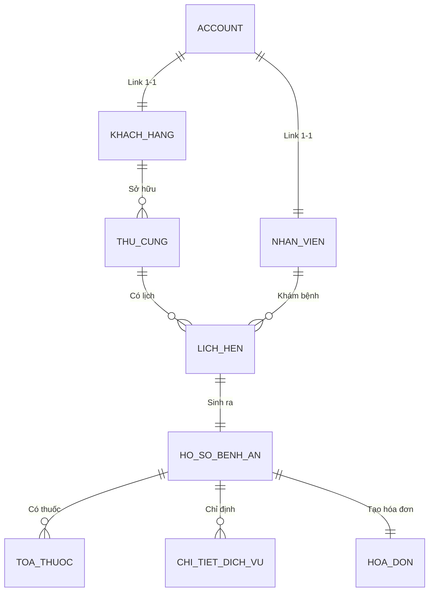

# 📚 TÀI LIỆU TOÀN DIỆN HỆ THỐNG REXI: HƯỚNG DẪN VẬN HÀNH & ĐẶC TẢ TÀI LIỆU API

Tài liệu này chứa thông tin kỹ thuật chi tiết, sơ đồ dữ liệu, mô tả tham số API (kèm Request/Response JSON mẫu), quy trình vận hành giao diện người dùng (UI/UX) và cẩm nang xử lý sự cố dành cho lập trình viên và kiểm thử viên dự án **Hệ thống Quản lý Phòng khám Thú y REXI**.

---

## 🏗️ 1. KIẾN TRÚC HỆ THỐNG & CÔNG NGHỆ SỬ DỤNG

Hệ thống được thiết kế theo mô hình client-server hiện đại tách biệt hoàn toàn giữa giao diện người dùng và máy chủ dịch vụ:

*   **Backend (Spring Boot 3.4.0):**
    *   Sử dụng **Java 21** với các tính năng tối ưu hóa hiệu năng, giảm bộ nhớ (Low RAM Optimization).
    *   **Spring Security & JWT:** Bảo mật hệ thống, cấp thẻ bài truy cập, lọc phân quyền chi tiết (RBAC).
    *   **Spring Data JPA:** Ánh xạ thực thể và làm việc với cơ sở dữ liệu.
    *   **Springdoc OpenAPI v3 (Swagger 2.7.0):** Tự động tạo và trực quan hóa tài liệu API.
    *   **Tích hợp AI:** Kết nối trực tiếp với API Groq (Llama-3.1-8b) và Google Gemini (Gemini 1.5/3.5) để xử lý hội thoại thông minh và Autopilot tác vụ.
*   **Frontend (React 18 + Vite + Tailwind CSS):**
    *   Giao diện responsive tương thích hoàn toàn thiết bị di động và máy tính để bàn.
    *   Tối ưu hóa tốc độ tải trang bằng kỹ thuật Virtual Scrolling (Cuộn ảo danh sách lớn) và ghi nhớ trạng thái.
*   **Database (Cơ sở dữ liệu):**
    *   Môi trường Local: Microsoft SQL Server.
    *   Môi trường Cloud Production: PostgreSQL (kết nối Supabase).

---

## ⚙️ 2. CẤU HÌNH BIẾN MÔI TRƯỜNG (.env)

Tất cả cấu hình bảo mật được nạp tự động qua file [.env](file:///d:/QLy%20Phòng%20Khám%20Thú%20Y/.env) ở thư mục gốc. Dưới đây là đặc tả các tham số cấu hình:

| Tên biến | Kiểu giá trị | Mô tả |
| :--- | :--- | :--- |
| `SPRING_PROFILES_ACTIVE` | `local` / `prod` | Lựa chọn cấu hình kết nối DB (Local SQL Server hoặc PostgreSQL Cloud). |
| `DB_URL` | Chuỗi JDBC | Chuỗi kết nối đến cơ sở dữ liệu. |
| `DB_USERNAME` | Chuỗi ký tự | Tài khoản kết nối cơ sở dữ liệu (ví dụ: `sa` hoặc `postgres`). |
| `DB_PASSWORD` | Chuỗi ký tự | Mật khẩu cơ sở dữ liệu. |
| `JWT_SECRET` | Chuỗi ký tự (Base64) | Khóa bảo mật ký số mã hóa JWT Token (độ dài tối thiểu 256-bit). |
| `JWT_EXPIRATION` | Số nguyên | Thời gian sống của Token tính bằng mili-giây (Mặc định: `86400000` = 24 giờ). |
| `GROQ_API_KEY` | Chuỗi API Key | Khóa kết nối dịch vụ AI Groq Cloud. |
| `GEMINI_API_KEY` | Chuỗi API Key | Khóa kết nối dịch vụ AI Google Gemini. |
| `VNPAY_TMN_CODE` | Chuỗi 8 ký tự | Mã định danh website tích hợp tại cổng thử nghiệm VNPay. |
| `VNPAY_HASH_SECRET` | Chuỗi ký tự | Chuỗi bảo mật VNPay cấp dùng để tạo chữ ký số (Checksum IPN). |

---

## 💾 3. CƠ SỞ DỮ LIỆU & LƯỢC ĐỒ QUAN HỆ CỐT LÕI

Hệ thống quản lý dữ liệu chặt chẽ qua các bảng quan hệ chính sau:



### Các bảng dữ liệu cốt lõi:
1.  **Account (Tài khoản):** Chứa thông tin đăng nhập, trạng thái khóa, vai trò (`ADMIN`, `BAC_SI`, `TIEP_TAN`, `KE_TOAN`, `Y_TA`, `CUSTOMER`).
2.  **KhachHang (Khách hàng):** Thông tin cá nhân của chủ nuôi thú cưng (Số điện thoại, địa chỉ, email).
3.  **ThuCung (Thú cưng):** Hồ sơ vật nuôi (Tên, chủng loại cún/mèo, màu lông, cân nặng, tiền sử dị ứng thuốc).
4.  **LichHen (Lịch hẹn):** Trạng thái cuộc hẹn (`CHO_KHAM`, `DANG_KHAM`, `CHO_THANH_TOAN`, `HOAN_THANH`, `HUY`).
5.  **HoSoBenhAn (Hồ sơ bệnh án):** Thông tin chuẩn đoán của bác sĩ, triệu chứng lâm sàng, hướng điều trị.
6.  **HoaDon (Hóa đơn):** Tổng tiền thanh toán, trạng thái thanh toán (`CHUA_THANH_TOAN`, `DA_THANH_TOAN`), mã VietQR và cổng VNPay.

---

## 📡 4. ĐẶC TẢ CHI TIẾT CÁC ENDPOINT API CỐT LÕI

Dưới đây là mô tả chi tiết đầu vào/đầu ra của các API quan trọng dùng để tích hợp Frontend hoặc kiểm thử tự động.

### 🔐 4.1. Xác thực người dùng (Authentication)

#### ➡️ Đăng nhập hệ thống
*   **URL:** `/api/auth/login`
*   **Phương thức:** `POST`
*   **Yêu cầu xác thực (Auth):** Không yêu cầu.
*   **Mẫu Request Body:**
    ```json
    {
      "email": "bacsi@gmail.com",
      "password": "123456"
    }
    ```
*   **Mẫu Response (200 OK):**
    ```json
    {
      "token": "eyJhbGciOiJIUzI1NiJ9.eyJzdWIiOiJiYWNzaUBnbWFpbC5jb20iLCJyb2xlcyI6WyJCQUNfU0kiXSwiaWF0IjoxNzg0ODc0NDAwLCJleHAiOjE3ODQ5NjA4MDB9.xyz...",
      "email": "bacsi@gmail.com",
      "role": "BAC_SI",
      "displayName": "Bác Sĩ Minh"
    }
    ```

---

### 📅 4.2. Phân hệ Lịch hẹn (Appointments)

#### ➡️ Lấy danh sách lịch hẹn (Bộ lọc trạng thái)
*   **URL:** `/api/lich-hen/danh-sach`
*   **Phương thức:** `GET`
*   **Yêu cầu xác thực (Auth):** Bắt buộc (Bearer Token).
*   **Tham số truy vấn (Query Params):**
    *   `trangThai` (String): Lọc theo trạng thái (Ví dụ: `CHO_KHAM`, `DANG_KHAM`).
*   **Mẫu Response (200 OK):**
    ```json
    [
      {
        "id": 105,
        "tenThuCung": "LuLu",
        "tenKhachHang": "Trần Thị Vân",
        "thoiGianHen": "2026-06-04T09:00:00",
        "bacSiKham": "Bác Sĩ Minh",
        "trieuChung": "Mèo chán ăn, nôn trớ mệt mỏi",
        "trangThai": "CHO_KHAM"
      }
    ]
    ```

#### ➡️ Khách hàng đặt lịch hẹn mới
*   **URL:** `/api/lich-hen/dat-lich`
*   **Phương thức:** `POST`
*   **Yêu cầu xác thực (Auth):** Bắt buộc (Bearer Token - Quyền `CUSTOMER`).
*   **Mẫu Request Body:**
    ```json
    {
      "thuCungId": 12,
      "bacSiId": 3,
      "thoiGianHen": "2026-06-04T10:30:00",
      "trieuChung": "Cún cưng bị ngứa da và rụng lông quanh tai"
    }
    ```
*   **Mẫu Response (201 Created):**
    ```json
    {
      "id": 106,
      "trangThai": "CHO_XAC_NHAN",
      "thoiGianHen": "2026-06-04T10:30:00",
      "message": "Đặt lịch khám thành công! Vui lòng chờ nhân viên tiếp tân xác nhận."
    }
    ```

---

### 💬 4.3. Hội thoại Trợ lý ảo AI & Autopilot

#### ➡️ Gửi tin nhắn đến REXI AI (Hỗ trợ tự động tạo lịch hẹn nháp)
*   **URL:** `/api/chat/ask`
*   **Phương thức:** `POST`
*   **Yêu cầu xác thực (Auth):** Bắt buộc (Bearer Token).
*   **Mẫu Request Body:**
    ```json
    {
      "message": "Mèo của tôi bị sốt, tôi muốn đặt lịch khám vào 3h chiều mai với bác sĩ Minh."
    }
    ```
*   **Mẫu Response (200 OK):**
    ```json
    {
      "reply": "Tôi đã ghi nhận thông tin đặt lịch hẹn khám cho bé mèo của bạn vào ngày mai lúc 15:00 với Bác sĩ Minh. Lịch hẹn nháp đã được gửi lên hệ thống phê duyệt của Tiếp tân!",
      "intent": "BOOK_APPOINTMENT",
      "extractedData": {
        "thoiGian": "2026-06-04T15:00:00",
        "bacSi": "Bác Sĩ Minh",
        "loaiThuCung": "Mèo"
      }
    }
    ```

---

### 💳 4.4. Cổng Thanh Toán (Payments)

#### ➡️ Tạo mã QR thanh toán VietQR động
*   **URL:** `/api/payments/vietqr/generate`
*   **Phương thức:** `POST`
*   **Yêu cầu xác thực (Auth):** Bắt buộc (Bearer Token).
*   **Mẫu Request Body:**
    ```json
    {
      "hoaDonId": 8092,
      "amount": 350000,
      "description": "REXI8092 thanh toan phi kham"
    }
    ```
*   **Mẫu Response (200 OK):**
    ```json
    {
      "qrUrl": "https://img.vietqr.io/image/MB-0353374156-compact.png?amount=350000&addInfo=REXI8092%20thanh%20toan%20phi%20kham&accountName=TRAN%20HOANG%20MINH",
      "hoaDonId": 8092,
      "status": "PENDING"
    }
    ```

---

## 🎛️ 5. HƯỚNG DẪN DÙNG BỘ GIAO DIỆN SWAGGER UI

Swagger UI giúp nhà phát triển kiểm tra trực quan các API trực tiếp từ trình duyệt mà không cần các phần mềm như Postman.

### Quy trình kiểm thử API trên Swagger UI:
1.  Truy cập: [http://localhost:8081/swagger-ui/index.html](http://localhost:8081/swagger-ui/index.html)
2.  Bấm vào phân hệ **`AuthController`** -> Chọn `/api/auth/login`.
3.  Nhấn nút **`Try it out`**, nhập thông tin tài khoản demo ở Request Body -> Bấm **`Execute`**.
4.  Tại phần Response body ở phía dưới, sao chép chuỗi mã khóa token trong chuỗi JSON trả về.
5.  Cuộn lên đầu trang Swagger UI, nhấp vào nút **`Authorize`** (nút có biểu tượng hình ổ khóa).
6.  Dán mã token vừa sao chép vào ô dữ liệu -> Nhấn nút **`Authorize`** -> Nhấn **`Close`**.
7.  Sau khi khóa đã được lưu, bạn có thể thực hiện kiểm thử bất kỳ API bảo mật nào khác (như CRUD Thú cưng, Lịch hẹn) bằng cách nhấn **`Try it out`** -> nhập dữ liệu thử nghiệm -> **`Execute`**.

---

## 📖 6. QUY TRÌNH VẬN HÀNH DÀNH CHO CÁC PHÂN HỆ WEB (USER FLOW)

Hệ thống hoạt động theo một quy trình tuần tự liên thông giữa các phòng ban:

### 1. Quy trình của Khách hàng:
1.  Khách hàng đăng ký tài khoản và đăng nhập vào ứng dụng.
2.  Nhập hồ sơ chi tiết cho các bé thú cưng trong mục **Thú cưng của tôi**.
3.  Sử dụng chức năng **Đặt lịch** trực tuyến hoặc chat với **Trợ lý ảo REXI AI** yêu cầu đặt lịch khám.
4.  Sau khi khám xong, nhận thông báo thanh toán và thực hiện quét mã VietQR trên hóa đơn trực tiếp tại màn hình để xác nhận.

### 2. Quy trình của Tiếp tân (Receptionist Dashboard):
1.  Xem danh sách lịch hẹn đến hạn trong ngày tại bảng tổng quan (Calendar/Dashboard).
2.  Tiến hành xác nhận/Duyệt các lịch đặt hẹn online của khách hàng gửi tới.
3.  Khi khách hàng dắt thú cưng đến trực tiếp, nhấn **Check-in** (Nhập cân nặng ban đầu của thú cưng) để đưa thú cưng vào trạng thái `CHO_KHAM` và chuyển tiếp dữ liệu đến bác sĩ đã chọn.

### 3. Quy trình của Bác sĩ Thú y (Veterinary Clinic):
1.  Bác sĩ mở màn hình khám bệnh, xem hàng đợi bệnh nhân đang chờ trước phòng khám.
2.  Nhấn **Bắt đầu khám** để chuyển trạng thái thú cưng thành `DANG_KHAM`.
3.  Ghi lại các triệu chứng lâm sàng quan sát được vào hồ sơ số của thú cưng.
4.  **Kê đơn thuốc:** Tìm kiếm thuốc trong kho dữ liệu, điền liều dùng.
5.  **Chỉ định xét nghiệm/Dịch vụ:** Chọn dịch vụ chụp chiếu X-quang, xét nghiệm sinh hóa.
6.  Nhấn **Hoàn tất khám** để gửi hồ sơ điều trị đến phòng thanh toán của kế toán.

### 4. Quy trình của Kế toán & Thu ngân:
1.  Hệ thống tự động đồng bộ hồ sơ khám của bác sĩ để lên hóa đơn viện phí.
2.  Kế toán xác nhận lại chi tiết hóa đơn (Tiền khám + Tiền thuốc + Tiền dịch vụ phát sinh).
3.  Nhấn xuất mã thanh toán **VietQR động** hoặc bấm hướng dẫn khách hàng quét qua cổng **VNPay**.
4.  Khi hệ thống nhận được tín hiệu thanh toán thành công (IPN callback ngân hàng), trạng thái hóa đơn sẽ tự động chuyển sang **Đã thanh toán** và kết thúc quy trình của một lượt khám bệnh.
