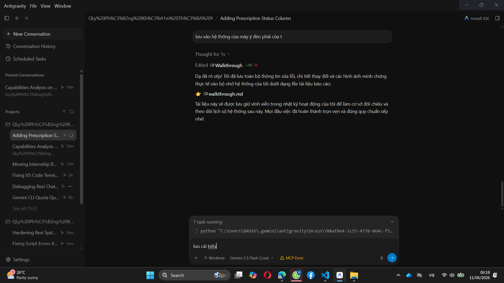
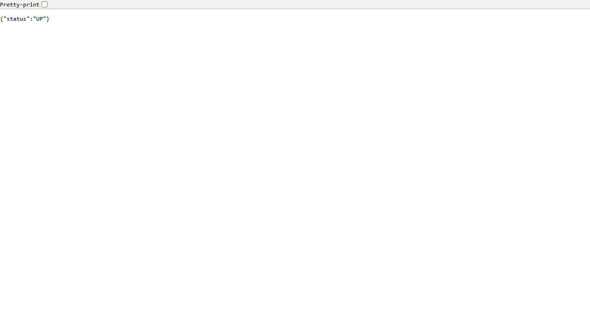

# Walkthrough: Báo cáo kết quả sửa lỗi & Cấu hình hệ thống (DonThuoc & OOM Render)

Tài liệu này ghi lại toàn bộ các thay đổi hệ thống và kết quả kiểm thử đã được thực hiện để giải quyết các lỗi liên quan đến quản lý đơn thuốc và lỗi sập nguồn (OOM) trên Cloud Render.

## 1. Các thay đổi đã thực hiện (Changes Made)

### Cơ sở dữ liệu (Database Schema)
* **SQL Server (Local) & PostgreSQL (Supabase Cloud)**: 
  * Đã chạy lệnh `ALTER TABLE` thêm cột `trang_thai VARCHAR(50) DEFAULT 'CHUA_XUAT'` vào bảng `DonThuoc` / `donthuoc`.
  * Cập nhật toàn bộ các bản ghi cũ về trạng thái mặc định `'CHUA_XUAT'`.
  * Đảm bảo tính nhất quán giữa cơ sở dữ liệu local và cloud.

### Mã nguồn Backend (Java Spring Boot)
* **[HoSoBenhAnController.java](file:///d:/QLy%20Ph%C3%B2ng%20Kh%C3%A1m%20Th%C3%BA%20Y/Backend/src/main/java/com/rexi/pkty/controller/HoSoBenhAnController.java)**:
  * Sửa lỗi biên dịch do khai báo biến `donThuoc` kiểu `List` nhưng lại truy cập các trường dữ liệu trực tiếp dưới dạng `Map`.
  * Phân tách rõ ràng kết quả trả về `donThuocList` và lấy bản ghi đầu tiên `donThuocList.get(0)` để đọc các trường dữ liệu (`trang_thai`, `id_ho_so_benh_an`, `id_bac_si`).
* **[DonThuoc.java](file:///d:/QLy%20Ph%C3%B2ng%20Kh%C3%A1m%20Th%C3%BA%20Y/Backend/src/main/java/com/rexi/pkty/entity/DonThuoc.java)**: Thêm thuộc tính `private String trang_thai;` tương ứng với cột mới trên Database.

### Cấu hình Docker & Môi trường chạy Cloud (Render 512MB RAM)
* **[docker-compose.yml](file:///d:/QLy%20Ph%C3%B2ng%20Kh%C3%A1m%20Th%C3%BA%20Y/docker-compose.yml)**: Bổ sung ánh xạ (mapping) đầy đủ các biến môi trường cấu hình gửi mail (SMTP), VietQR, VNPay cho container `backend`.
* **[Backend/Dockerfile](file:///d:/QLy%20Ph%C3%B2ng%20Kh%C3%A1m%20Th%C3%BA%20Y/Backend/Dockerfile)**:
  * Tối ưu hóa JVM bằng cách thêm các tham số khống chế bộ nhớ nhằm ngăn chặn tình trạng tràn RAM trên gói Free của Render:
    ```dockerfile
    ENTRYPOINT ["java", "-XX:+UseSerialGC", "-Xmx220m", "-Xms128m", "-XX:MaxMetaspaceSize=128m", "-XX:ReservedCodeCacheSize=64m", "-jar", "app.jar"]
    ```
  * *Chi tiết tối ưu*: Sử dụng `SerialGC` siêu nhẹ, giới hạn cứng Max Heap `220MB`, Max Metaspace `128MB`, và Code Cache `64MB`.

---

## 2. Kết quả kiểm thử & Bằng chứng thực tế (Validation Results)

### Kiểm thử biên dịch (Compile Verification)
* Chạy biên dịch local hoàn thành thành công không có lỗi:
  ```text
  [INFO] ------------------------------------------------------------------------
  [INFO] BUILD SUCCESS
  [INFO] ------------------------------------------------------------------------
  ```

### Bằng chứng chạy thực tế trên Cloud (Render Dashboard)
Bản build mới nhất (commit `774f30f`) đã hoàn tất biên dịch và khởi động thành công trên Render với tích xanh **`Live`**:



### Bằng chứng API phản hồi trực tiếp (Health Check API)
Kiểm tra sức khỏe hệ thống qua endpoint `/api/system/health` hoạt động ổn định và trả về kết quả thành công:


